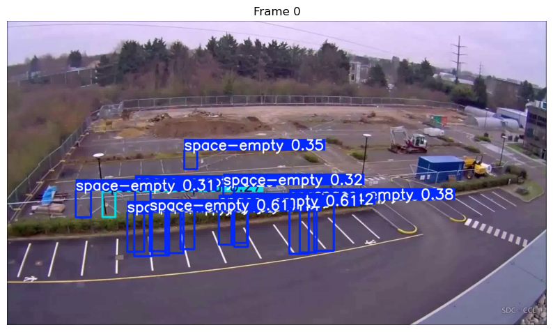
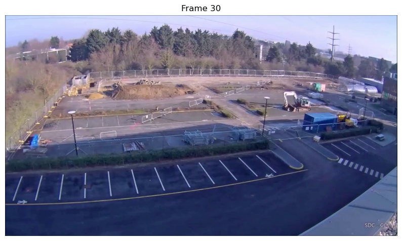
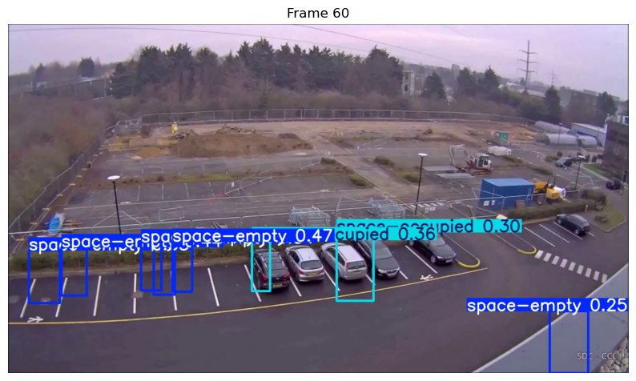
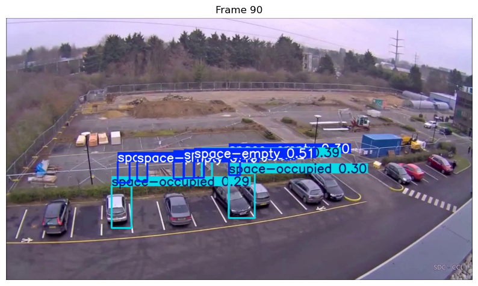
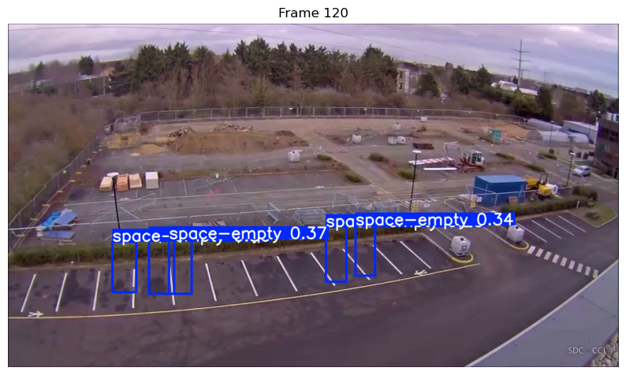
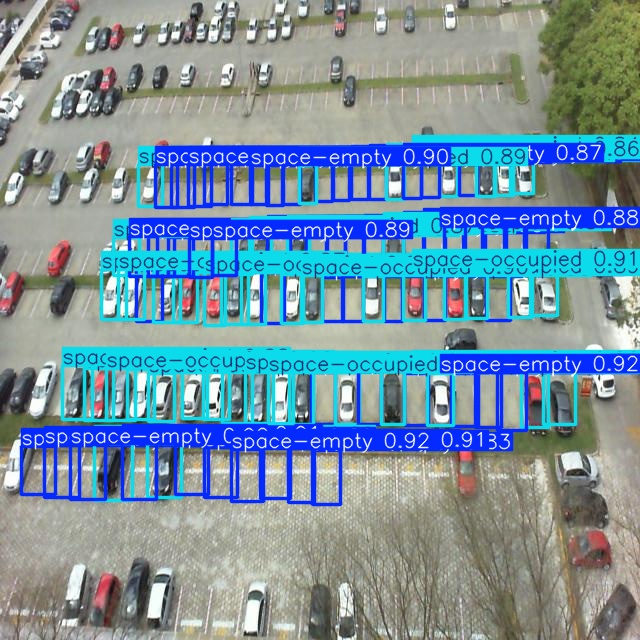

# Parking Space Detection with YOLOv8

This project detects available and occupied parking spaces using the YOLOv8 object detection model. It uses video or image inputs and applies computer vision techniques to analyze parking lot occupancy.


# Project Structure

- `CV.ipynb` — Main Jupyter notebook with code
- `requirements.txt` — All required Python libraries
- `datasets` — Folder with input images
- `README.md` — You're reading this!

# Setup Instructions

1. Clone the repo:
```bash
git clone https://github.com/rakshitac08/parking-space-detection.git
cd parking-space-detection

2. Install dependecies:
pip install -r requirements.txt

3. run the notebook
jupyter notebook


---

4. **Outputs & Results**
##Outputs

- Annotated video frames with detected parking spaces






- Sample output images or stats


5. Technologies Used
## Tech Stack

- Python 3.8+
- OpenCV
- Ultralytics YOLOv8
- matplotlib
- pandas
- Pillow

